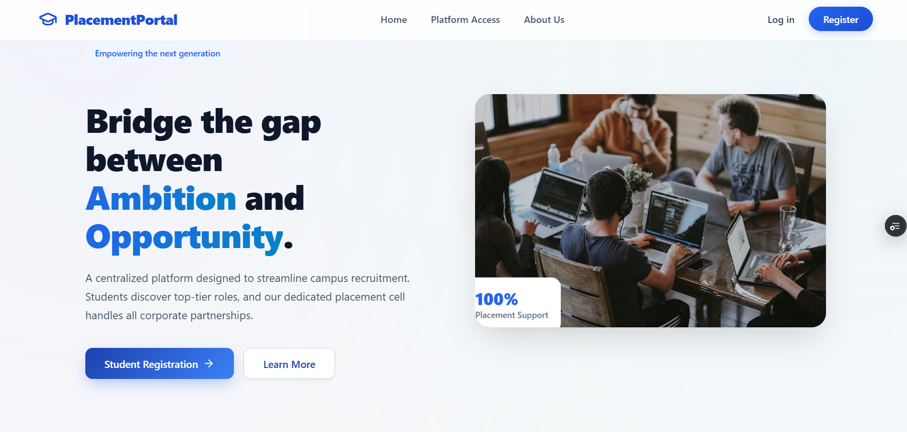
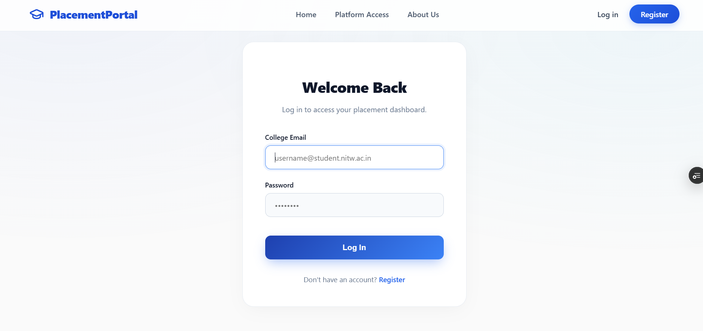
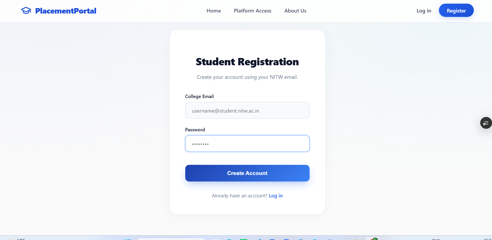
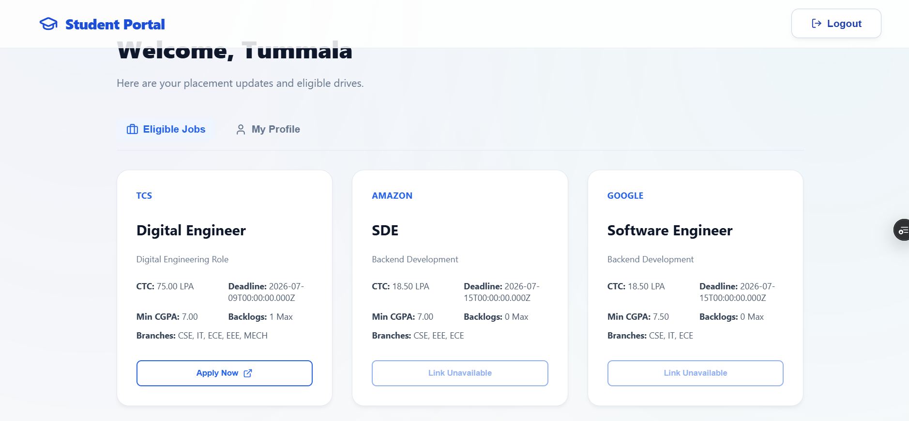
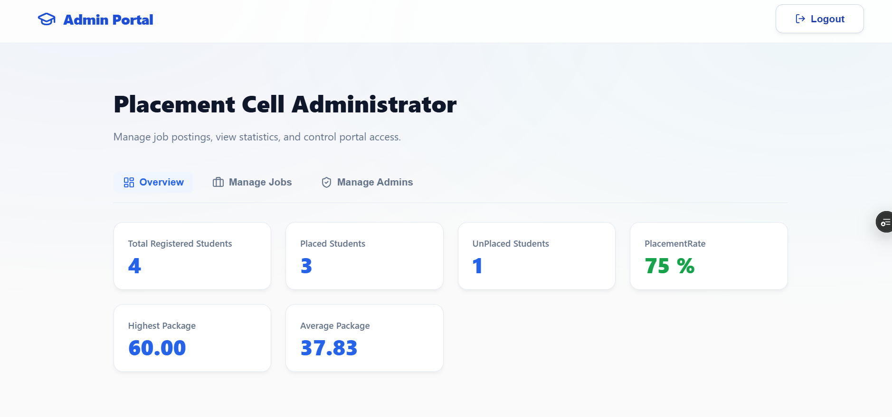

# Placement Management Portal

A full-stack web application that streamlines the campus placement process for students, recruiters, and administrators.

## Live Demo

🌐 **Application:** https://carrerconnect-lake.vercel.app/
## 📸 Application Preview

### Webiste 

### Login Page

### Register Page

### Student Dashboard

### Admin Dashboard

## ✨ Features

### 👨‍🎓 Student
- Register and log in securely
- Create and update profile information
- Upload resume
- View available job opportunities
- Apply for eligible jobs
- Track application status

### 👨‍💼 Administrator
- Manage student accounts
- Add, edit, and remove job postings
- View and manage applications
- Monitor placement activities
- Update application statuses
- Access placement statistics through a dashboard

### 🔐 Security
- JWT-based authentication
- Role-based access control
- Passwords encrypted using bcrypt
- Protected API routes
## 🛠️ Tech Stack

### Frontend
- React
- React Router
- HTML5
- CSS3
- JavaScript (ES6+)
- Axios

### Backend
- Node.js
- Express.js
- JWT (JSON Web Token)
- bcrypt
- Multer

### Database
- PostgreSQL (Neon)

### Deployment
- Vercel (Frontend)
- Render (Backend)
- Neon PostgreSQL (Database)

### Development Tools
- Git
- GitHub
- Visual Studio Code
- Postman
